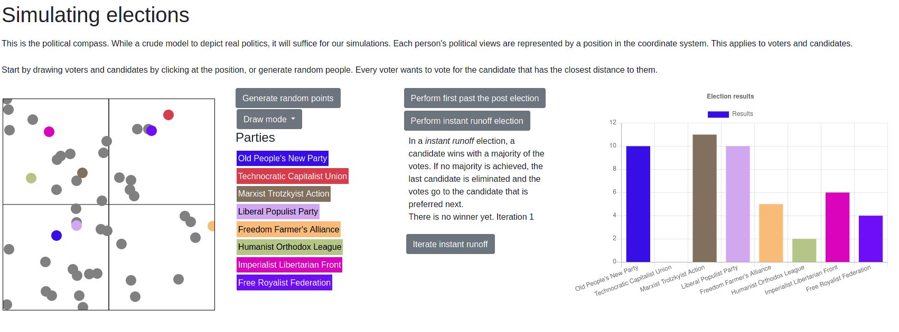

# elections
This tool allows you to simulate elections. Place candidates and voters on a political coordinate system, and compare different voting systems to get different results.

Currently only first past the post is implemented.

### Usage

Add voters by clicking into the coordinate system. Add candidates by clicking into the coordinate system and setting the appropriate draw mode.  
Party names are just for flavor and do not have any real political meaning or valuation.  
Select a Voting mechanism and look at the results.

### Deployment

All Javascript is client side so no special server is required. Just clone the repository and open index.html in a browser. Tested in Mozilla Firefox.